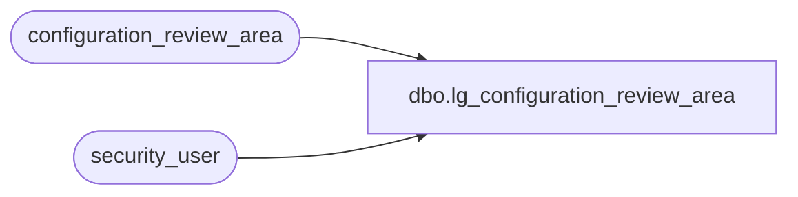

# dbo.lg_configuration_review_area

**Database:** auditworks  
**Server:** bedrockdb01  

## Architecture Diagram



## Table Dependencies

| Referenced Table |
|---|
| configuration_review_area |
| security_user |

## View Code

```sql
create view dbo.lg_configuration_review_area 
as 
select 	s.table_maintenance_area_id, 
	s.table_maintenance_area_desc,
	s.priority_no,
	s.table_name,
	s.group1_heading,
	s.group2_heading,
	s.field_code_heading, 
	s.field_setting_heading,
	s.table_maintenance_area_module,
	s.language_id
from configuration_review_area s, security_user u
where u.user_id = suser_sname() 
  and IsNull(u.language_id, 1033) = s.language_id
```

