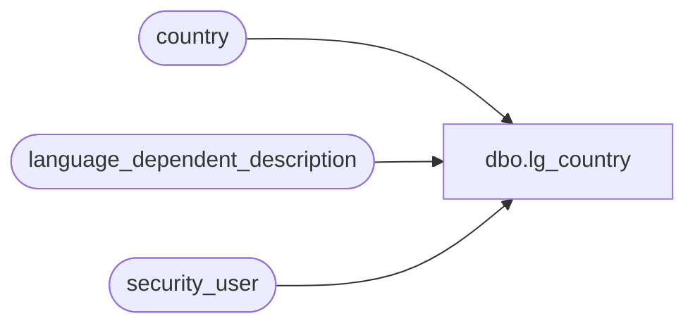

# dbo.lg_country

**Database:** auditworks  
**Server:** bedrockdb01  

## Architecture Diagram



## Table Dependencies

| Referenced Table |
|---|
| country |
| language_dependent_description |
| security_user |

## View Code

```sql
create view dbo.lg_country           

  as select 
country_id, currency_id, country_code,
IsNull(ld.display_description, country_description) as country_description,
active_flag,
updatestamp
from country s, security_user u, language_dependent_description ld
where u.user_id = suser_sname() and s.resource_id *= ld.resource_id and u.language_id *= ld.language_id
```

