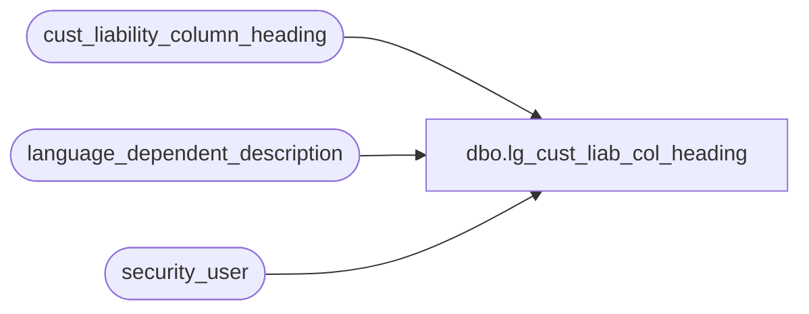

# dbo.lg_cust_liab_col_heading

**Database:** auditworks  
**Server:** bedrockdb01  

## Architecture Diagram



## Table Dependencies

| Referenced Table |
|---|
| cust_liability_column_heading |
| language_dependent_description |
| security_user |

## View Code

```sql
create view dbo.lg_cust_liab_col_heading 
as 

SELECT reference_type, unit_amount_flag, column_no, 
        IsNull(ld.display_description, column_heading) as column_heading, 
        s.resource_id  
FROM cust_liability_column_heading s
     INNER JOIN security_user u
        ON u.user_id = suser_sname()
      LEFT OUTER JOIN language_dependent_description ld 
        ON s.resource_id = ld.resource_id
       AND u.language_id = ld.language_id
WHERE s.column_heading IS NOT NULL
```

