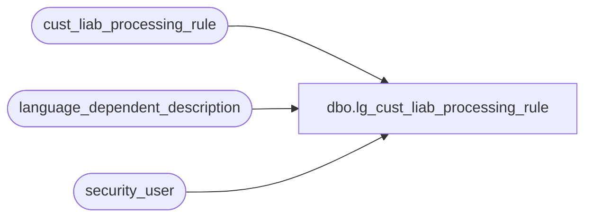

# dbo.lg_cust_liab_processing_rule

**Database:** auditworks  
**Server:** bedrockdb01  

## Architecture Diagram



## Table Dependencies

| Referenced Table |
|---|
| cust_liab_processing_rule |
| language_dependent_description |
| security_user |

## View Code

```sql
create view dbo.lg_cust_liab_processing_rule as

SELECT rule_id,transaction_category, 
        IsNull(ld.display_description, rule_id_description) as rule_id_description, 
        reference_type, line_object, line_action, line_object_offset, line_action_offset,
        line_object_balance, line_action_balance, store_no, register_no, cashier_no,  
        reference_no_qty_per_trans, next_reference_no, generate_reference_no, 
        s.resource_id, 
        balance_adjustment_type,
    balance_adjustment_amount,
    balance_exclusion_column_no,
    processing_activation_type,
    age_selection_criteria,
    processing_day,
    last_processing_date,
    inactivity_selection_criteria
FROM cust_liab_processing_rule s
     INNER JOIN security_user u
        ON u.user_id = suser_sname()
      LEFT OUTER JOIN language_dependent_description ld 
        ON s.resource_id = ld.resource_id
       AND u.language_id = ld.language_id
```

