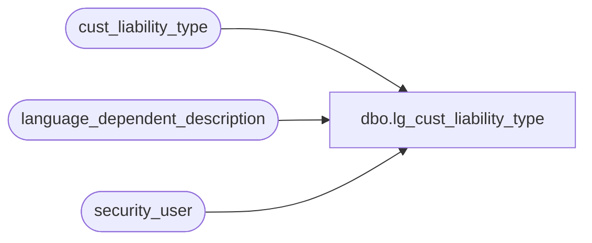

# dbo.lg_cust_liability_type

**Database:** auditworks  
**Server:** bedrockdb01  

## Architecture Diagram



## Table Dependencies

| Referenced Table |
|---|
| cust_liability_type |
| language_dependent_description |
| security_user |

## View Code

```sql
create view dbo.lg_cust_liability_type      
as 

SELECT reference_type, 
	tracking_id, 
	IsNull(ld.display_description, tracking_id_description) as tracking_id_description,
	expiry_days,
	customer_liability_group, 
	s.resource_id,
	s.active_flag 
FROM cust_liability_type s
     INNER JOIN security_user u
        ON u.user_id = suser_sname()
      LEFT OUTER JOIN language_dependent_description ld 
        ON s.resource_id = ld.resource_id
       AND u.language_id = ld.language_id
```

