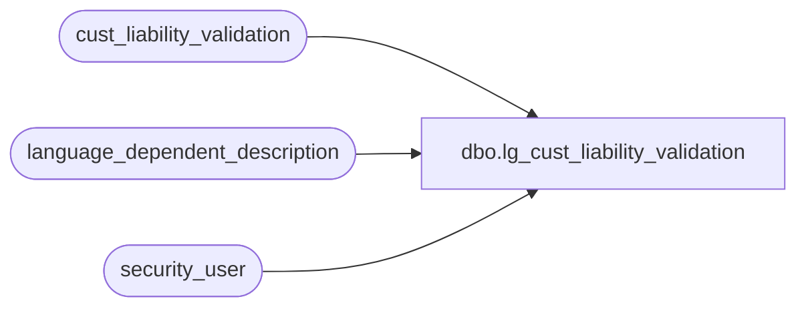

# dbo.lg_cust_liability_validation

**Database:** auditworks  
**Server:** bedrockdb01  

## Architecture Diagram



## Table Dependencies

| Referenced Table |
|---|
| cust_liability_validation |
| language_dependent_description |
| security_user |

## View Code

```sql
create view dbo.lg_cust_liability_validation      
as 

SELECT validation_id, line_action, line_object_type, default_priority_no, 
        IsNull(ld.display_description, validation_description) as validation_description,
        IsNull(ld2.display_description, reject_reason_description) as reject_reason_description,
        liability_amount_factor, receivable_amount_factor, amount_3_factor, amount_4_factor,
        amount_5_factor, amount_6_factor, amount_7_factor, amount_8_factor, amount_9_factor, 
        amount_10_factor, stocked_amount_factor, stocked_factor, stocked_stolen_factor, 
        issued_factor, stolen_from_cust_factor, forfeited_factor, amount_outstanding_factor,
        units_outstanding_factor, units_2_factor, units_3_factor, units_4_factor, 
        units_5_factor, include_current_amt, include_current_unit, sign_to_reject1, 
        sign_to_reject2, validation_resource_id, reason_resource_id 
FROM cust_liability_validation s
     INNER JOIN security_user u
        ON u.user_id = suser_sname()
      LEFT OUTER JOIN language_dependent_description ld 
        ON s.validation_resource_id = ld.resource_id
       AND u.language_id = ld.language_id
      LEFT OUTER JOIN language_dependent_description ld2
        ON s.reason_resource_id = ld2.resource_id
       AND u.language_id = ld2.language_id
```

