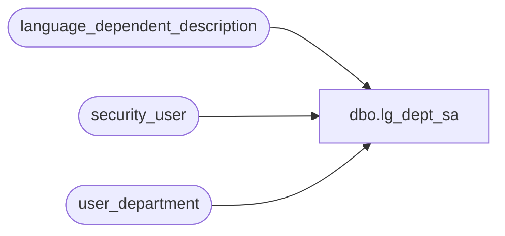

# dbo.lg_dept_sa

**Database:** auditworks  
**Server:** bedrockdb01  

## Architecture Diagram



## Table Dependencies

| Referenced Table |
|---|
| language_dependent_description |
| security_user |
| user_department |

## View Code

```sql
create view dbo.lg_dept_sa 
AS

SELECT upc_lookup_division, 
       department_code, 
       department_description = IsNull(ld.display_description, department_description)
FROM user_department s
     LEFT JOIN language_dependent_description ld ON (s.resource_id = ld.resource_id)
     RIGHT JOIN security_user u ON (u.language_id = ISNULL(ld.language_id, u.language_id))
WHERE u.user_id = suser_sname()
```

