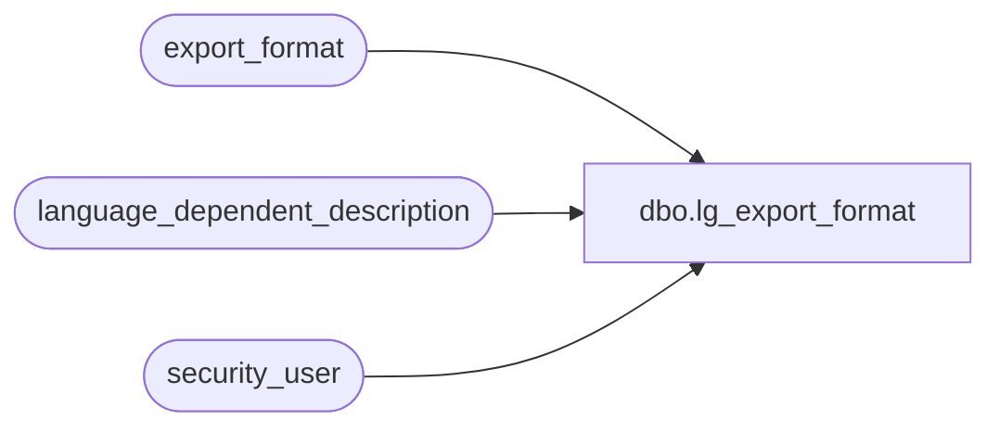

# dbo.lg_export_format

**Database:** auditworks  
**Server:** bedrockdb01  

## Architecture Diagram



## Table Dependencies

| Referenced Table |
|---|
| export_format |
| language_dependent_description |
| security_user |

## View Code

```sql
create view dbo.lg_export_format           
as
SELECT interface_id
,export_format
,IsNull(ld.display_description, export_format_description) as export_format_description
,export_procedure_name
,export_bcp_fmt_name
,export_table_name
,export_table_reclen
,s.resource_id
,s.auto_set_posting_request
,s.max_retry_qty
,s.stream_no
,s.include_timestamp
,s.copy_no
,s.export_file_prefix
,s.export_file_suffix
,s.export_destination_path
,s.ftp_flag
,s.ftp_host
,s.ftp_hid
,s.ftp_HPWD
,s.if_export_code
,s.batch_size
FROM export_format s
     INNER JOIN security_user u
        ON u.user_id = suser_sname()
      LEFT OUTER JOIN language_dependent_description ld 
        ON s.resource_id = ld.resource_id
       AND u.language_id = ld.language_id
```

