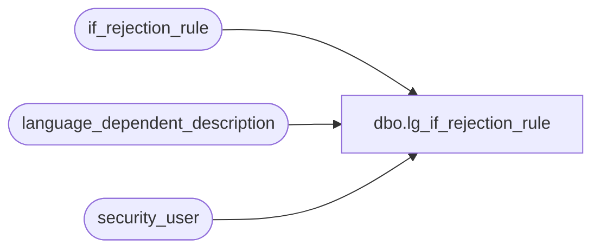

# dbo.lg_if_rejection_rule

**Database:** auditworks  
**Server:** bedrockdb01  

## Architecture Diagram



## Table Dependencies

| Referenced Table |
|---|
| if_rejection_rule |
| language_dependent_description |
| security_user |

## View Code

```sql
create view dbo.lg_if_rejection_rule 
as
SELECT 	if_rejection_reason,
		if_rejection_description =ISNULL(ld.display_description, if_rejection_description),
		allow_deferral,
		s.resource_id,
		s.active_rejection_rule,
		s.transaction_line_flag,
		s.user_id,
		s.external_detection,
		s.allow_override,
		s.revalidation_ENTY_TYPE
FROM if_rejection_rule s
     LEFT JOIN language_dependent_description ld ON (s.resource_id = ld.resource_id)
     RIGHT JOIN security_user u ON (u.language_id = ISNULL(ld.language_id, u.language_id))
WHERE u.user_id = suser_sname()
```

