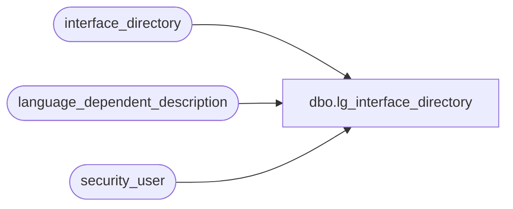

# dbo.lg_interface_directory

**Database:** auditworks  
**Server:** bedrockdb01  

## Architecture Diagram



## Table Dependencies

| Referenced Table |
|---|
| interface_directory |
| language_dependent_description |
| security_user |

## View Code

```sql
create view dbo.lg_interface_directory 
as

SELECT interface_id
,IsNull(ld.display_description, interface_description) as interface_description
,update_timing
,move_updates
,live_date
,ascii_export
,interface_voided_transactions
,all_modifications_relevant
,archive_correction_method
,edit_mass_update_flag
,applicability_method
,basic_dtlmr_subsystem
,object_id
,s.resource_id
,s.min_compatible_exe
,s.dayend_subject_to_posting
,s.disallow_modification
,s.history_days
,s.include_all_trans_with_cust
FROM interface_directory s
     INNER JOIN security_user u
        ON u.user_id = suser_sname()
      LEFT OUTER JOIN language_dependent_description ld 
        ON s.resource_id = ld.resource_id
       AND u.language_id = ld.language_id
WHERE (u.current_exe IS NULL OR s.min_compatible_exe IS NULL OR u.current_exe >= s.min_compatible_exe)
```

