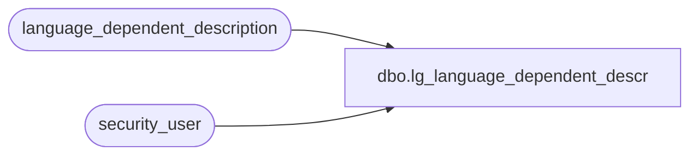

# dbo.lg_language_dependent_descr

**Database:** auditworks  
**Server:** bedrockdb01  

## Architecture Diagram



## Table Dependencies

| Referenced Table |
|---|
| language_dependent_description |
| security_user |

## View Code

```sql
create view dbo.lg_language_dependent_descr           
 as
   select d.resource_id as resource_id,
          d.display_description as display_description
     from security_user u,
          language_dependent_description d
    where u.language_id = d.language_id and  
          u.user_id = suser_sname()
```

