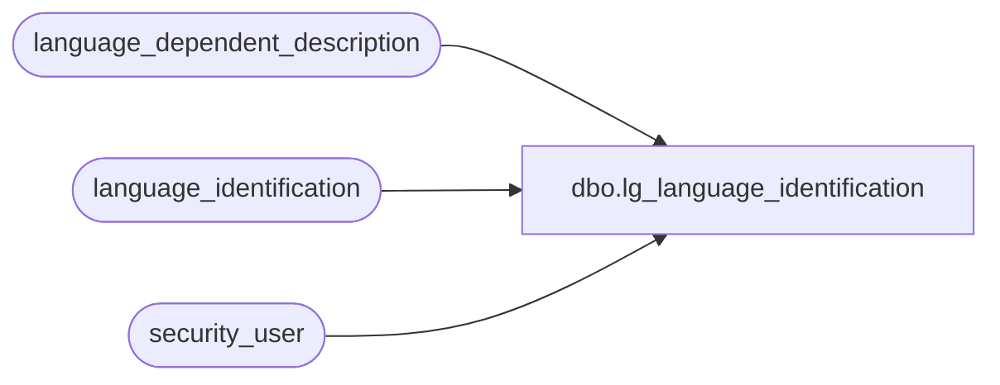

# dbo.lg_language_identification

**Database:** auditworks  
**Server:** bedrockdb01  

## Architecture Diagram



## Table Dependencies

| Referenced Table |
|---|
| language_dependent_description |
| language_identification |
| security_user |

## View Code

```sql
create view dbo.lg_language_identification 
as
SELECT s.language_id
,IsNull(ld.display_description, s.language_description) as language_description
,s.active_flag
,s.root_language_id
FROM language_identification s
     INNER JOIN security_user u
        ON u.user_id = suser_sname()
      LEFT OUTER JOIN language_dependent_description ld 
        ON s.resource_id = ld.resource_id
       AND u.language_id = ld.language_id
```

