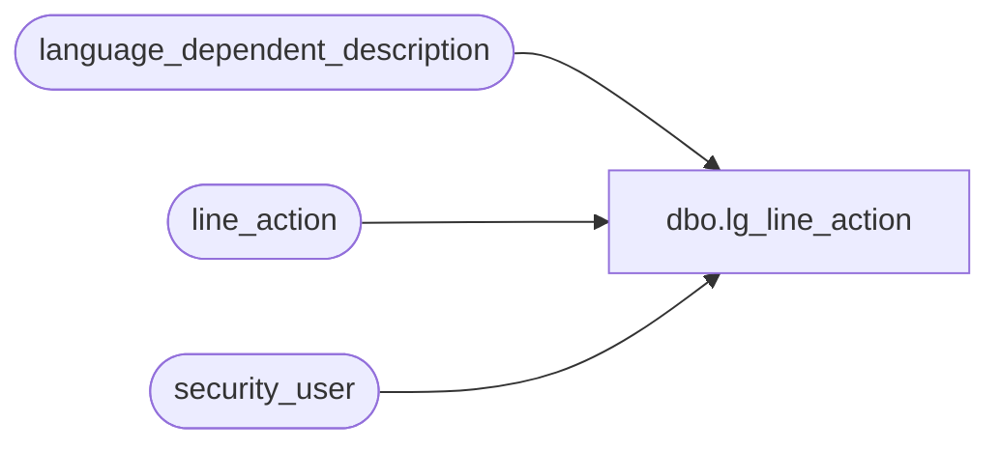

# dbo.lg_line_action

**Database:** auditworks  
**Server:** bedrockdb01  

## Architecture Diagram



## Table Dependencies

| Referenced Table |
|---|
| language_dependent_description |
| line_action |
| security_user |

## View Code

```sql
create view dbo.lg_line_action 
as

SELECT line_action
,line_action_system_descr
,IsNull(ld.display_description, line_action_display_descr) as line_action_display_descr
,s.resource_id
FROM line_action s
     INNER JOIN security_user u
        ON u.user_id = suser_sname()
      LEFT OUTER JOIN language_dependent_description ld 
        ON s.resource_id = ld.resource_id
       AND u.language_id = ld.language_id
```

