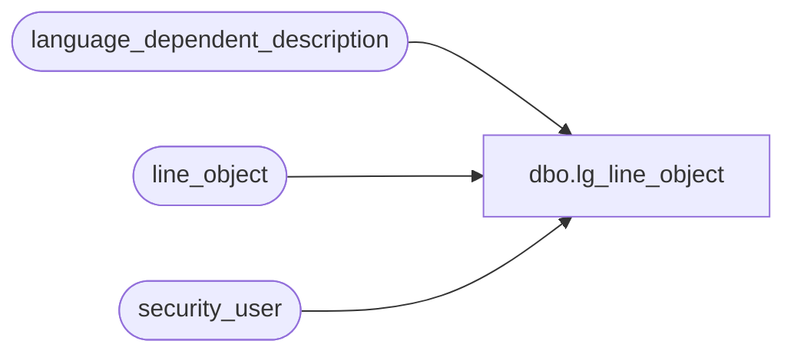

# dbo.lg_line_object

**Database:** auditworks  
**Server:** bedrockdb01  

## Architecture Diagram



## Table Dependencies

| Referenced Table |
|---|
| language_dependent_description |
| line_object |
| security_user |

## View Code

```sql
create view dbo.lg_line_object 
as

SELECT line_object
,line_object_type
,IsNull(ld.display_description, line_object_description) as line_object_description
,default_tax_rate_code
,s.resource_id
,s.object_export_code
,s.proration_method
,s.tax_item_group_id
,s.lookup_pos_code
,s.pos_description_token_list
,s.auto_config_verified
,s.disregard_pos_descr_change
,s.lookup_partial_pos_code
,s.active_flag
FROM line_object s
     INNER JOIN security_user u
        ON u.user_id = suser_sname()
      LEFT OUTER JOIN language_dependent_description ld 
        ON s.resource_id = ld.resource_id
       AND u.language_id = ld.language_id
```

