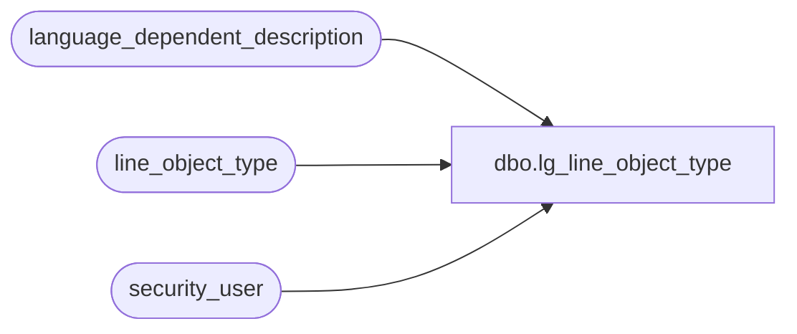

# dbo.lg_line_object_type

**Database:** auditworks  
**Server:** bedrockdb01  

## Architecture Diagram



## Table Dependencies

| Referenced Table |
|---|
| language_dependent_description |
| line_object_type |
| security_user |

## View Code

```sql
create view dbo.lg_line_object_type 
as
SELECT line_object_type
,object_type_system_descr
,IsNull(ld.display_description, object_type_display_descr) as object_type_display_descr
,s.resource_id
FROM line_object_type s
     INNER JOIN security_user u
        ON u.user_id = suser_sname()
      LEFT OUTER JOIN language_dependent_description ld 
        ON s.resource_id = ld.resource_id
       AND u.language_id = ld.language_id
```

