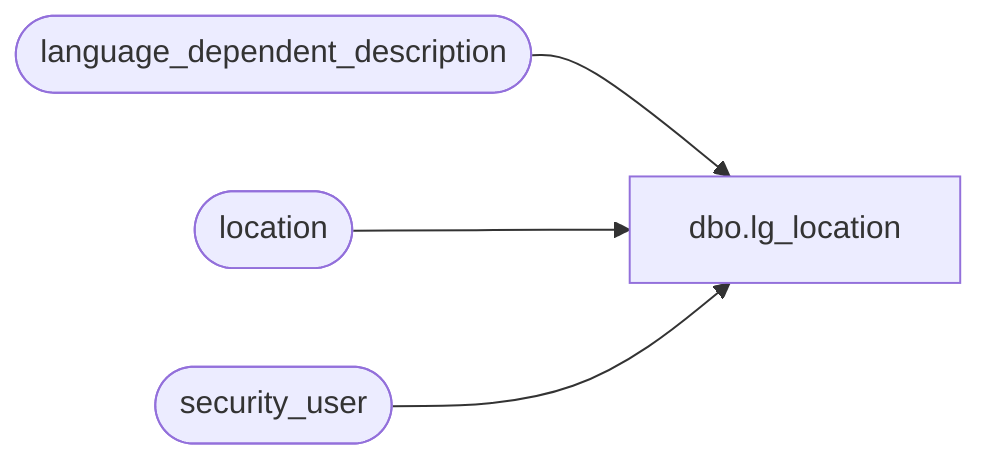

# dbo.lg_location

**Database:** auditworks  
**Server:** bedrockdb01  

## Architecture Diagram



## Table Dependencies

| Referenced Table |
|---|
| language_dependent_description |
| location |
| security_user |

## View Code

```sql
create view dbo.lg_location 
as
SELECT location_type
,location_code
,IsNull(ld.display_description, location_name) as location_name
,pos_location_code
,in_location_code
,s.resource_id
,s.gmt_offset_hrs_daylight
,s.gmt_offset_hrs_standard 
,s.in_location_type
FROM location s
     INNER JOIN security_user u
        ON u.user_id = suser_sname()
      LEFT OUTER JOIN language_dependent_description ld 
        ON s.resource_id = ld.resource_id
       AND u.language_id = ld.language_id
```

