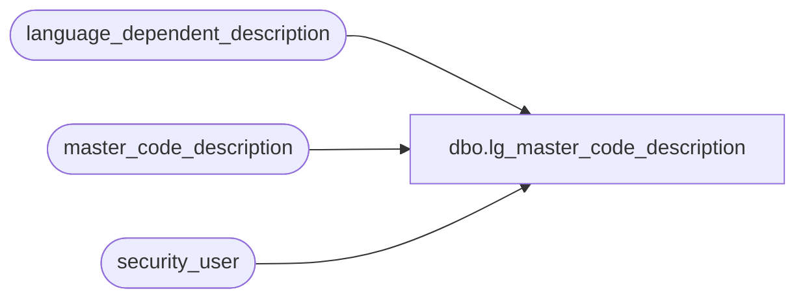

# dbo.lg_master_code_description

**Database:** auditworks  
**Server:** bedrockdb01  

## Architecture Diagram



## Table Dependencies

| Referenced Table |
|---|
| language_dependent_description |
| master_code_description |
| security_user |

## View Code

```sql
create view dbo.lg_master_code_description 
as

SELECT table_name
,column_name
,code
,IsNull(ld.display_description, code_display_descr) as code_display_descr
,code_system_descr
,remark
,s.resource_id
FROM master_code_description s
     INNER JOIN security_user u
        ON u.user_id = suser_sname()
      LEFT OUTER JOIN language_dependent_description ld 
        ON s.resource_id = ld.resource_id
       AND u.language_id = ld.language_id
```

