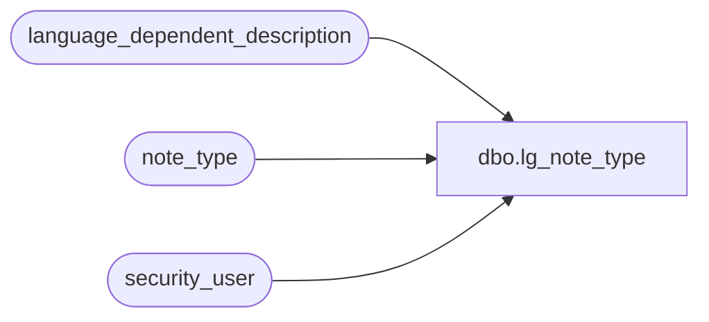

# dbo.lg_note_type

**Database:** auditworks  
**Server:** bedrockdb01  

## Architecture Diagram



## Table Dependencies

| Referenced Table |
|---|
| language_dependent_description |
| note_type |
| security_user |

## View Code

```sql
create view dbo.lg_note_type           
as

SELECT note_type
,code_type
,IsNull(ld.display_description, note_type_description) as note_type_description
,code_meaning_control
,par_type
,par_value_from_range
,par_value_to_range
,par_comment
,par_min_length
,par_max_length
,s.resource_id
,s.active_flag
,s.employee_validation
FROM note_type s
     LEFT JOIN language_dependent_description ld ON (s.resource_id = ld.resource_id)
     RIGHT JOIN security_user u ON (u.language_id = ISNULL(ld.language_id, u.language_id))
WHERE u.user_id = suser_sname()
```

