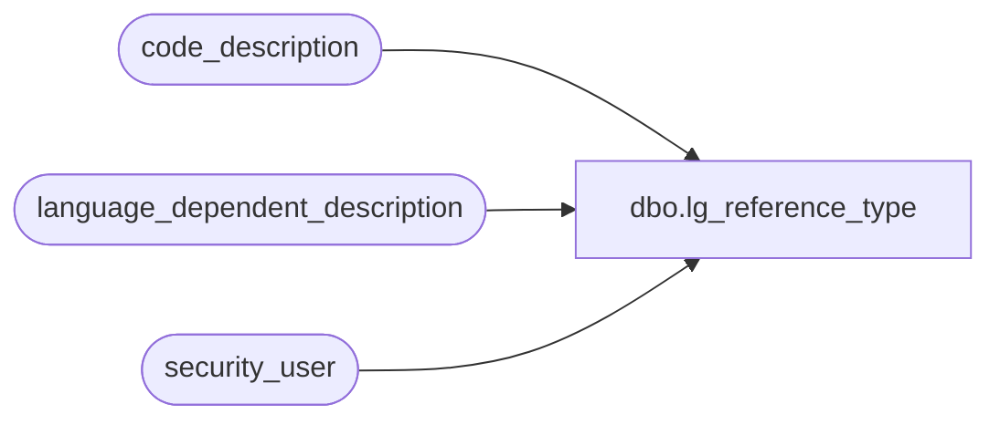

# dbo.lg_reference_type

**Database:** auditworks  
**Server:** bedrockdb01  

## Architecture Diagram



## Table Dependencies

| Referenced Table |
|---|
| code_description |
| language_dependent_description |
| security_user |

## View Code

```sql
create view dbo.lg_reference_type 
as select code_type
,code
,IsNull(ld.display_description, code_display_descr) as code_display_descr
,code_meaning_control
,code_system_descr
,s.resource_id
,s.min_compatible_exe
FROM code_description s
     INNER JOIN security_user u
        ON u.user_id = suser_sname()
      LEFT OUTER JOIN language_dependent_description ld 
        ON s.resource_id = ld.resource_id
       AND u.language_id = ld.language_id
WHERE(u.current_exe is null or s.min_compatible_exe is null or 
      u.current_exe >= s.min_compatible_exe )
  AND code_type = 22 and ((code > 0 and code < 9) or (code >= 201 and code <= 204) or code in (220, 221, 228) or code_meaning_control = 'U')
```

