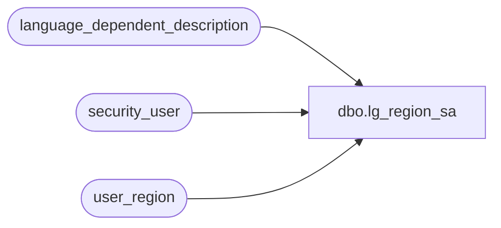

# dbo.lg_region_sa

**Database:** auditworks  
**Server:** bedrockdb01  

## Architecture Diagram



## Table Dependencies

| Referenced Table |
|---|
| language_dependent_description |
| security_user |
| user_region |

## View Code

```sql
create view dbo.lg_region_sa           

 
AS
    SELECT region_code, IsNull(ld.display_description, region_name) as region_name 
      FROM user_region s, security_user u, language_dependent_description ld
where u.user_id = suser_sname() and s.resource_id *= ld.resource_id and u.language_id *= ld.language_id
```

