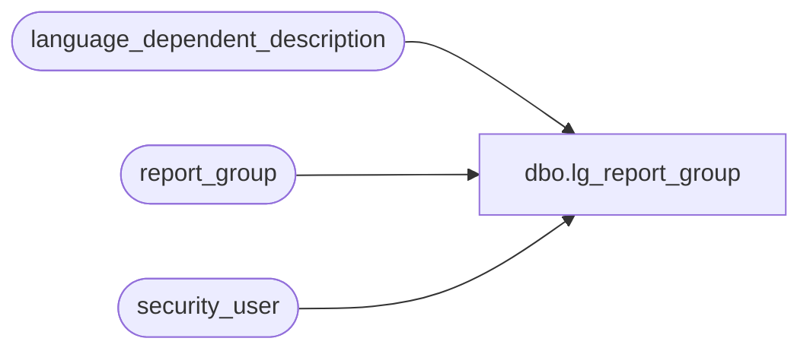

# dbo.lg_report_group

**Database:** auditworks  
**Server:** bedrockdb01  

## Architecture Diagram



## Table Dependencies

| Referenced Table |
|---|
| language_dependent_description |
| report_group |
| security_user |

## View Code

```sql
create view dbo.lg_report_group 
AS
SELECT report_group_code
,IsNull(ld.display_description, report_group_description) as report_group_description
,s.feature_code
,last_audit_datetime
,s.resource_id
FROM report_group s
INNER JOIN security_user u ON (u.user_id = suser_sname())
LEFT JOIN language_dependent_description ld ON (s.resource_id = ld.resource_id AND u.language_id = ld.language_id)
```

