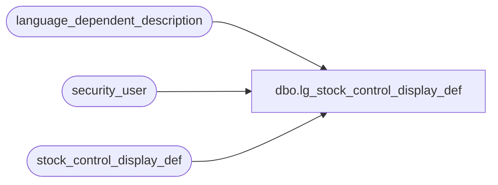

# dbo.lg_stock_control_display_def

**Database:** auditworks  
**Server:** bedrockdb01  

## Architecture Diagram



## Table Dependencies

| Referenced Table |
|---|
| language_dependent_description |
| security_user |
| stock_control_display_def |

## View Code

```sql
create view dbo.lg_stock_control_display_def    
as

SELECT
 display_def_id, 
 IsNull(ld.display_description, display_def_descr) as display_def_descr,
 upc_no_fe_resource_id, 
 merchandise_key_fe_resource_id, initiated_by_fe_resource_id, units_fe_resource_id, 
 other_store_no_fe_resource_id, location_no_fe_resource_id, vendor_no_fe_resource_id, 
 count_date_fe_resource_id, pos_identifier_fe_resource_id, pos_id_type_fe_resource_id,
 pos_deptclass_fe_resource_id, upc_division_fe_resource_id, originating_str_fe_resource_id, 
 default_initiated_by_host, default_pos_identifier_type, s.resource_id,
 s.active_flag, imrd_fe_resource_id, reason_fe_resource_id 
FROM stock_control_display_def s
     INNER JOIN security_user u
        ON u.user_id = suser_sname()
      LEFT OUTER JOIN language_dependent_description ld 
        ON s.resource_id = ld.resource_id
       AND u.language_id = ld.language_id
```

