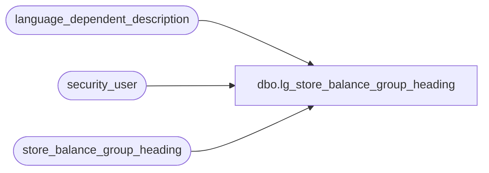

# dbo.lg_store_balance_group_heading

**Database:** auditworks  
**Server:** bedrockdb01  

## Architecture Diagram



## Table Dependencies

| Referenced Table |
|---|
| language_dependent_description |
| security_user |
| store_balance_group_heading |

## View Code

```sql
create view dbo.lg_store_balance_group_heading as

SELECT store_balance_group
,store_balance_section
,Substring(IsNull(ld.display_description, store_balance_group_descr), 1, 150) as store_balance_group_descr 
,Substring(IsNull(c1.display_description, column1_heading), 1, 60) as column1_heading
,Substring(IsNull(c2.display_description, column2_heading), 1, 60) as column2_heading
,Substring(IsNull(c3.display_description, column3_heading), 1, 60) as column3_heading
,s.resource_id
,column1_resource_id
,column2_resource_id
,column3_resource_id
FROM store_balance_group_heading s
     INNER JOIN security_user u
        ON u.user_id = suser_sname()
      LEFT OUTER JOIN language_dependent_description ld 
        ON s.resource_id = ld.resource_id
       AND u.language_id = ld.language_id
      LEFT OUTER JOIN language_dependent_description c1 
        ON s.column1_resource_id = c1.resource_id
       AND u.language_id = c1.language_id
      LEFT OUTER JOIN language_dependent_description c2 
        ON s.column2_resource_id = c2.resource_id
       AND u.language_id = c2.language_id
      LEFT OUTER JOIN language_dependent_description c3 
        ON s.column3_resource_id = c3.resource_id
       AND u.language_id = c3.language_id
```

