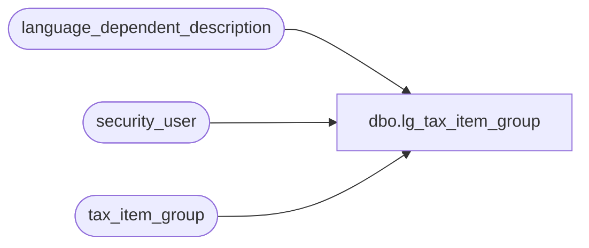

# dbo.lg_tax_item_group

**Database:** auditworks  
**Server:** bedrockdb01  

## Architecture Diagram



## Table Dependencies

| Referenced Table |
|---|
| language_dependent_description |
| security_user |
| tax_item_group |

## View Code

```sql
create view dbo.lg_tax_item_group 
as

SELECT tax_item_group_id
,tax_item_group_code
,IsNull(ld.display_description, tax_item_group_description) as tax_item_group_description
,s.resource_id
,s.line_object
,s.auto_gen_datetime
,s.auto_gen_source
FROM tax_item_group s
     INNER JOIN security_user u
        ON u.user_id = suser_sname()
      LEFT OUTER JOIN language_dependent_description ld 
        ON s.resource_id = ld.resource_id
       AND u.language_id = ld.language_id
```

