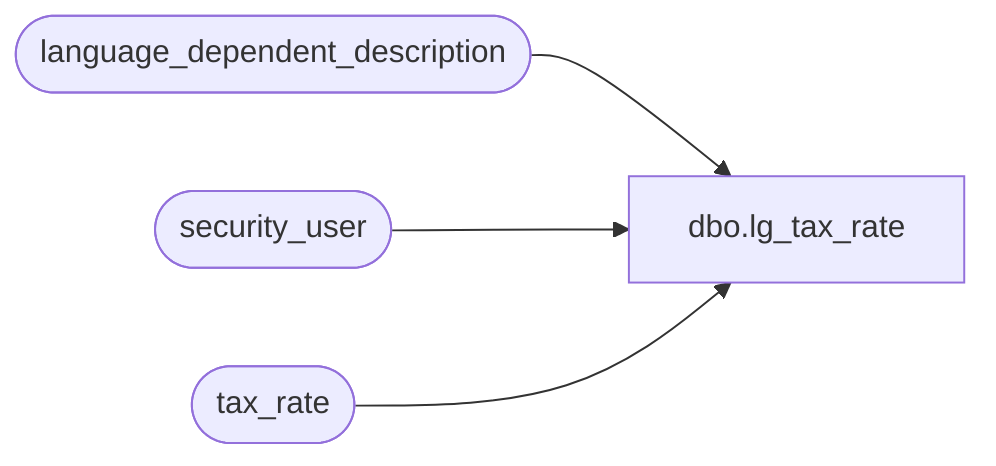

# dbo.lg_tax_rate

**Database:** auditworks  
**Server:** bedrockdb01  

## Architecture Diagram



## Table Dependencies

| Referenced Table |
|---|
| language_dependent_description |
| security_user |
| tax_rate |

## View Code

```sql
create view dbo.lg_tax_rate 
as

SELECT tax_jurisdiction
,tax_level
,tax_rate_code
,effective_from_date
,effective_until_date
,IsNull(ld.display_description, tax_rate_code_description) as tax_rate_code_description
,combined_rate
,federal_rate
,state_rate
,county_rate
,city_rate
,district_rate
,threshold_amount
,tax_on_threshold_excess
,tax_on_tax_level
,below_threshold_combined_rate
,below_federal_rate
,below_state_rate
,below_county_rate
,below_city_rate
,below_district_rate
,s.resource_id
FROM tax_rate s
     INNER JOIN security_user u
        ON u.user_id = suser_sname()
      LEFT OUTER JOIN language_dependent_description ld 
        ON s.resource_id = ld.resource_id
       AND u.language_id = ld.language_id
```

