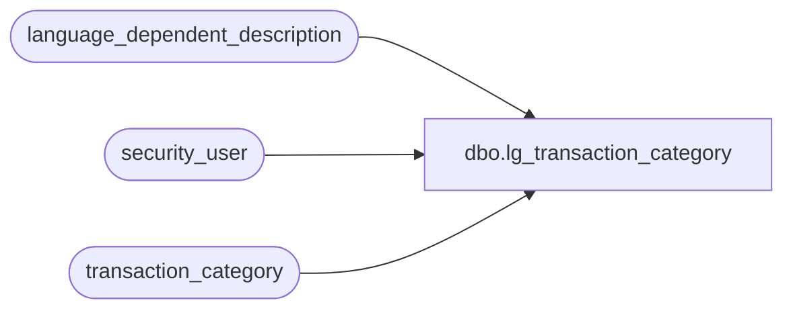

# dbo.lg_transaction_category

**Database:** auditworks  
**Server:** bedrockdb01  

## Architecture Diagram



## Table Dependencies

| Referenced Table |
|---|
| language_dependent_description |
| security_user |
| transaction_category |

## View Code

```sql
create view dbo.lg_transaction_category 
as

SELECT transaction_category
,IsNull(ld.display_description, description) as description
,update_register_activity
,archive_handling_method
,s.resource_id
,s.min_compatible_exe
,s.system_transaction_category
,s.system_ownership_flag
,s.active_flag
FROM transaction_category s
     INNER JOIN security_user u
        ON u.user_id = suser_sname()
      LEFT OUTER JOIN language_dependent_description ld 
        ON s.resource_id = ld.resource_id
       AND u.language_id = ld.language_id
WHERE (u.current_exe is null OR s.min_compatible_exe is null OR u.current_exe >= s.min_compatible_exe )
```

