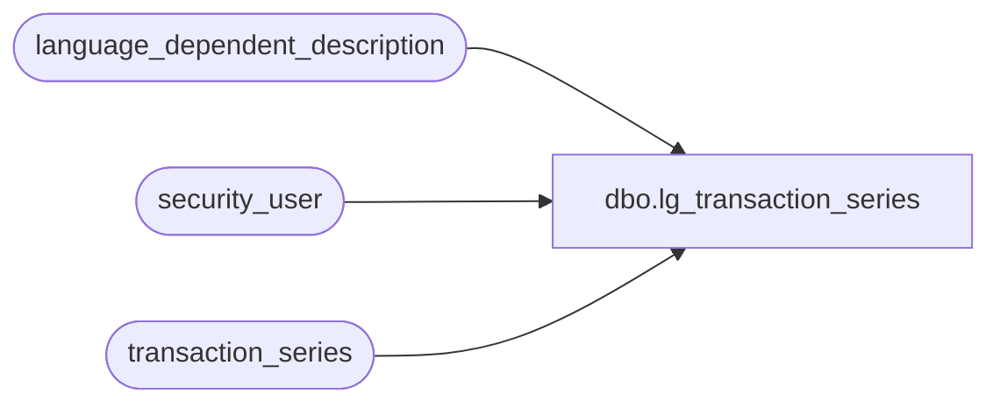

# dbo.lg_transaction_series

**Database:** auditworks  
**Server:** bedrockdb01  

## Architecture Diagram



## Table Dependencies

| Referenced Table |
|---|
| language_dependent_description |
| security_user |
| transaction_series |

## View Code

```sql
create view dbo.lg_transaction_series 
as

SELECT transaction_series
,ISNULL (ld.display_description,description) as description
,sequential
,comments
,code_meaning_control
,s.resource_id
,archived_series
,by_assigned_reg
,s.active_flag
,s.max_tran_num
,s.min_tran_num 
FROM transaction_series s
     INNER JOIN security_user u
        ON u.user_id = suser_sname()
      LEFT OUTER JOIN language_dependent_description ld 
        ON s.resource_id = ld.resource_id
       AND u.language_id = ld.language_id
WHERE s.active_flag > 0
```

