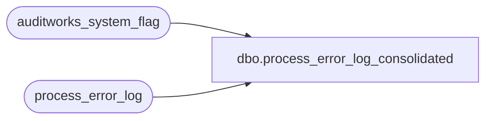

# dbo.process_error_log_consolidated

**Database:** auditworks  
**Server:** bedrockdb01  

## Architecture Diagram



## Table Dependencies

| Referenced Table |
|---|
| auditworks_system_flag |
| process_error_log |

## View Code

```sql
CREATE VIEW [dbo].[process_error_log_consolidated]
AS
SELECT convert(int, s.flag_numeric_value) instance_id, 
       p.process_no,
       p.error_code,
       p.error_timestamp,
       p.process_id,
       p.verified,
       p.support_call_reference_no,
       p.error_msg,
       p.memo1,
       p.memo2,
       p.memo3,
       p.memo_date,
       p.support_call_id,
       p.memo_date2,
       p.memo_date3,
       p.process_name,
       p.object_name,
       p.operation_name,
       p.message_id,
       p.entry_id * 10 + convert(int, s.flag_numeric_value) entry_id,
       p.stream_no,
       p.verification_remark,
       p.verified_date,
       p.user_id,
       p.verified_by_user_id,
       p.transaction_id, 
       p.entry_id real_entry_id
  FROM process_error_log p, auditworks_system_flag s
 WHERE s.flag_name = 'instance_id'
```

