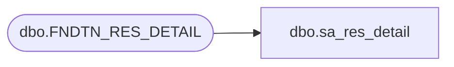

# dbo.sa_res_detail

**Database:** auditworks  
**Server:** bedrockdb01  

## Architecture Diagram



## Table Dependencies

| Referenced Table |
|---|
| dbo.FNDTN_RES_DETAIL |

## View Code

```sql
create view dbo.sa_res_detail AS
SELECT RESOURCE_ID resource_id,
       CULTURE_LCID culture_lcid,
       IS_USER is_user,
       RESOURCE_VALUE resource_value FROM foundation.dbo.FNDTN_RES_DETAIL
```

