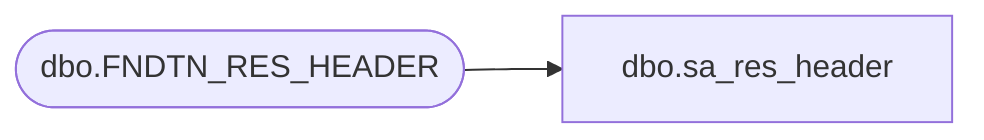

# dbo.sa_res_header

**Database:** auditworks  
**Server:** bedrockdb01  

## Architecture Diagram



## Table Dependencies

| Referenced Table |
|---|
| dbo.FNDTN_RES_HEADER |

## View Code

```sql
create view dbo.sa_res_header AS
SELECT RESOURCE_ID resource_id,
       NAMESPACE_NAME namespace_name,
       RESOURCE_NAME resource_name,
       IS_USER is_user,
       RESOURCE_TYPE resource_type,
       RESOURCE_COMMENT resource_comment,
       MESSAGE_BUTTON message_button,
       MESSAGE_ICON message_icon,
       MESSAGE_BUTTON_DEFAULT message_button_default,
       ACTIVE_FLAG active_flag FROM foundation.dbo.FNDTN_RES_HEADER  WHERE NAMESPACE_NAME = 'Nsb' OR NAMESPACE_NAME like 'Nsb.SalesAudit%'
```

