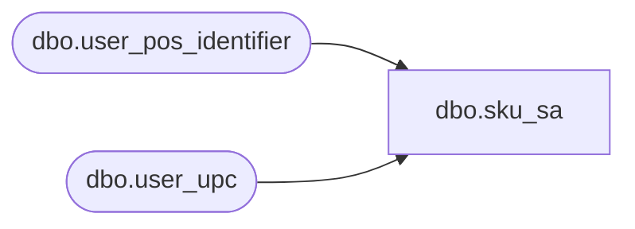

# dbo.sku_sa

**Database:** auditworks  
**Server:** bedrockdb01  

## Architecture Diagram



## Table Dependencies

| Referenced Table |
|---|
| dbo.user_pos_identifier |
| dbo.user_upc |

## View Code

```sql
create view dbo.sku_sa
AS 

SELECT p.upc_lookup_division, 
       p.upc_no, 
       p.pos_identifier sku,
       p.pos_identifier_type pos_identifier_type
  FROM auditworks.dbo.user_pos_identifier p
  WHERE p.pos_identifier_type >= 1
UNION
SELECT u.upc_lookup_division, 
       u.upc_no, 
       u.pos_identifier sku,
       u.pos_identifier_type pos_identifier_type
  FROM auditworks.dbo.user_upc u
       LEFT OUTER JOIN auditworks.dbo.user_pos_identifier p
         ON p.upc_no = u.upc_no
        AND p.upc_lookup_division = u.upc_lookup_division
        AND p.pos_identifier_type >= 1
 WHERE u.pos_identifier_type >= 1
   AND p.upc_no IS NULL
```

