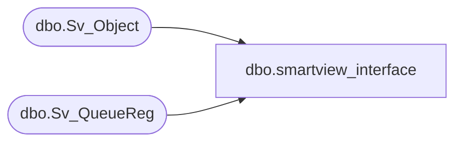

# dbo.smartview_interface

**Database:** auditworks  
**Server:** bedrockdb01  

## Architecture Diagram



## Table Dependencies

| Referenced Table |
|---|
| dbo.Sv_Object |
| dbo.Sv_QueueReg |

## View Code

```sql
CREATE VIEW [dbo].[smartview_interface] 
AS
-- updated 2014-11-27 to fix compatibility issue
SELECT sv.queue_id
	, sv.object_id
	, so.label_1 AS description
FROM foundation.dbo.Sv_QueueReg sv 
	LEFT OUTER JOIN foundation.dbo.Sv_Object so 
		ON sv.object_id = so.object_id
WHERE sv.db_group_id = 1400

-- 2014-11-27 old code that is causing an issue
--SELECT queue_id, sv.object_id, description = label_1
--  FROM foundation..Sv_QueueReg sv, foundation..Sv_Object so
-- WHERE db_group_id = 1400
--   AND sv.object_id *= so.object_id
```

