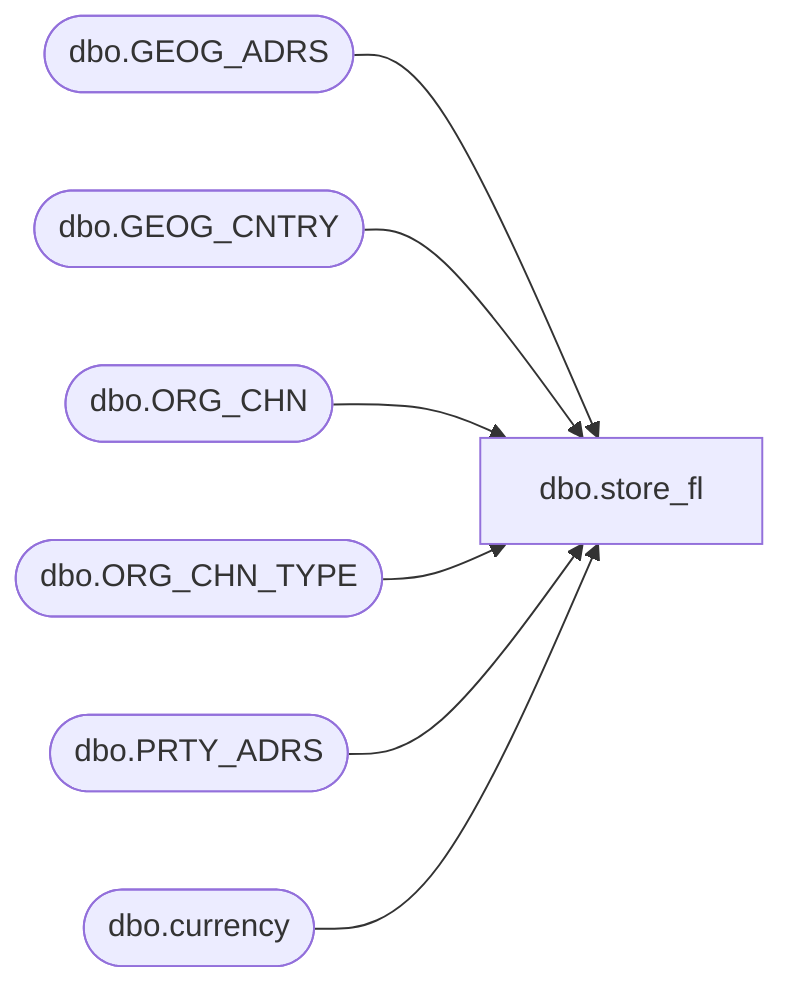

# dbo.store_fl

**Database:** auditworks  
**Server:** bedrockdb01  

## Architecture Diagram



## Table Dependencies

| Referenced Table |
|---|
| dbo.GEOG_ADRS |
| dbo.GEOG_CNTRY |
| dbo.ORG_CHN |
| dbo.ORG_CHN_TYPE |
| dbo.PRTY_ADRS |
| dbo.currency |

## View Code

```sql
create view dbo.store_fl  AS
SELECT 
	OC.ORG_CHN_NUM as store_no, 
	OC.ORG_CHN_NAME as store_name, 
	OC.ORG_CHN_SHRT_NAME as store_short_name,  
	store_manager = NULL, --no longer available
	open_period = NULL,  --no longer available
	comp_period = NULL,  --no longer available
	OC.CLS_DATE as closed_date, 
	CASE WHEN OCT.SYS_CODE = 'WH' OR OCT.SYS_CODE = 'DC' THEN 0 ELSE 1 END as selling_nonselling_flag, 
	OC.GL_CMPNY_NUM as gl_company,
	cu.currency_id,
	country_id = 0, -- updated later using country table in flash db
	OC.COMP_DATE as comp_date,
	OC.OPEN_DATE as open_date,
	division_code = 0,
	region_code = 0,
	district_code = 0,
        CASE  WHEN OC.ACTV = 0 THEN 'CLSD' /* can customize if store_status_code is used by flash queries */
        WHEN OC.CLS_DATE <= getdate() THEN 'CLSD'
        ELSE CASE WHEN OC.COMP_DATE IS NOT NULL THEN 'COMP'
             ELSE 'NCOMP'
             END
        END AS store_status_code,
        selling_space = 0,
        phone_no = null, --- primary
        GC.CNTRY_CODE_ISO2 AS country_code
 FROM dbo.ORG_CHN OC
 INNER JOIN dbo.ORG_CHN_TYPE OCT 
      ON OC.ORG_CHN_TYPE_CODE = OCT.ORG_CHN_TYPE_CODE
 INNER JOIN dbo.currency cu
      ON OC.DFLT_CRNCY_CODE = cu.currency_code
 LEFT OUTER JOIN dbo.PRTY_ADRS PA
      ON OC.PRTY_ID = PA.PRTY_ID
      AND OC.DFLT_ADRS_SEQ = PA.PRTY_ADRS_SEQ
      AND PA.EFCTV_STRT_DATE <= GETDATE()
      AND (PA.EFCTV_END_DATE >= GETDATE() OR PA.EFCTV_END_DATE IS NULL)      
 LEFT OUTER JOIN dbo.GEOG_ADRS GA 
      ON PA.ADRS_ID = GA.ADRS_ID     
 LEFT OUTER JOIN dbo.GEOG_CNTRY GC
      ON GA.CNTRY_CODE_ISO3 = GC.CNTRY_CODE_ISO3

-- If desired, can customize the view above by
--   replacing selling_space and phone_no (above) with the following subqueries
--   but this would decrease performance if the values are not needed :
   
--        selling_space = (SELECT SUM(OCL.AREA_SIZE) FROM dbo.ORG_CHN_LOC OCL
--                         WHERE OC.ORG_CHN_NUM = OCL.ORG_CHN_NUM),
--        phone_no = (SELECT PH.CNTCT FROM dbo.PRTY_CNTCT PH
--	      WHERE OC.PRTY_ID = PH.PRTY_ID
--	      AND PH.CNTCT_TYPE_CODE = 'TLPH' 
--	      AND PH.SEQ_NUM = 1),
```

