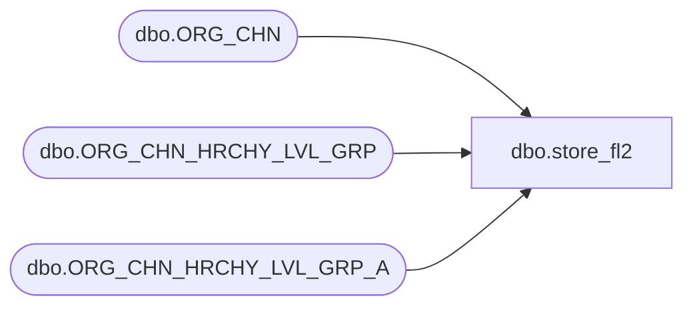

# dbo.store_fl2

**Database:** auditworks  
**Server:** bedrockdb01  

## Architecture Diagram



## Table Dependencies

| Referenced Table |
|---|
| dbo.ORG_CHN |
| dbo.ORG_CHN_HRCHY_LVL_GRP |
| dbo.ORG_CHN_HRCHY_LVL_GRP_A |

## View Code

```sql
create view dbo.store_fl2 
 AS
SELECT -- customize view to join to appropriate hierarchy after creating them in tm. Could hardcode unused columns to 0.
            store_no = OC.ORG_CHN_NUM, 
            division_code = (SELECT hl.HRCHY_LVL_GRP_CODE
            		FROM dbo.ORG_CHN_HRCHY_LVL_GRP hl, dbo.ORG_CHN_HRCHY_LVL_GRP_A hla
            		WHERE hl.HRCHY_LVL_GRP_ID = hla.HRCHY_LVL_GRP_ID
            		AND hl.HRCHY_ID = hla.HRCHY_ID
            		AND hl.HRCHY_LVL_ID = hla.HRCHY_LVL_ID
           		AND OC.ORG_CHN_NUM = hla.ORG_CHN_NUM
            		AND hl.HRCHY_ID = 0xDFD5BA7BC7D4094F863ED6C6329C37E4
            		AND hl.HRCHY_LVL_ID = 0xCEC83F3081FCB84BAC04BFAAC60E7E8A),
            region_code = (SELECT hl.HRCHY_LVL_GRP_CODE
            		FROM dbo.ORG_CHN_HRCHY_LVL_GRP hl, dbo.ORG_CHN_HRCHY_LVL_GRP_A hla
            		WHERE hl.HRCHY_LVL_GRP_ID = hla.HRCHY_LVL_GRP_ID
            		AND hl.HRCHY_ID = hla.HRCHY_ID
            		AND hl.HRCHY_LVL_ID = hla.HRCHY_LVL_ID
           		AND OC.ORG_CHN_NUM = hla.ORG_CHN_NUM
            		AND hl.HRCHY_ID = 0x3DF57CA9E828734F82D2470A038D76A5
            		AND hl.HRCHY_LVL_ID = 0x74A73953BD64784F86EC50BD9259B562),
            district_code = (SELECT hl.HRCHY_LVL_GRP_CODE
            		FROM dbo.ORG_CHN_HRCHY_LVL_GRP hl, dbo.ORG_CHN_HRCHY_LVL_GRP_A hla
            		WHERE hl.HRCHY_LVL_GRP_ID = hla.HRCHY_LVL_GRP_ID
            		AND hl.HRCHY_ID = hla.HRCHY_ID
            		AND hl.HRCHY_LVL_ID = hla.HRCHY_LVL_ID
           		AND OC.ORG_CHN_NUM = hla.ORG_CHN_NUM
            		AND hl.HRCHY_ID = 0x9C47857F69AEE34ABBF3A1D275887BB6
            		AND hl.HRCHY_LVL_ID = 0xE948282F166C0340959CB84F312C5275)
 FROM dbo.ORG_CHN OC
-- Modify the 0x values above to match the appropriate values from the following select
-- select HRCHY_LVL_ID, HRCHY_ID, HRCHY_LVL_DESC
-- from ORG_CHN_HRCHY_LVL
-- order by HRCHY_LVL_ID,HRCHY_ID
-- then modify views district_sa, division_sa and region_sa to use the same 0x values
```

