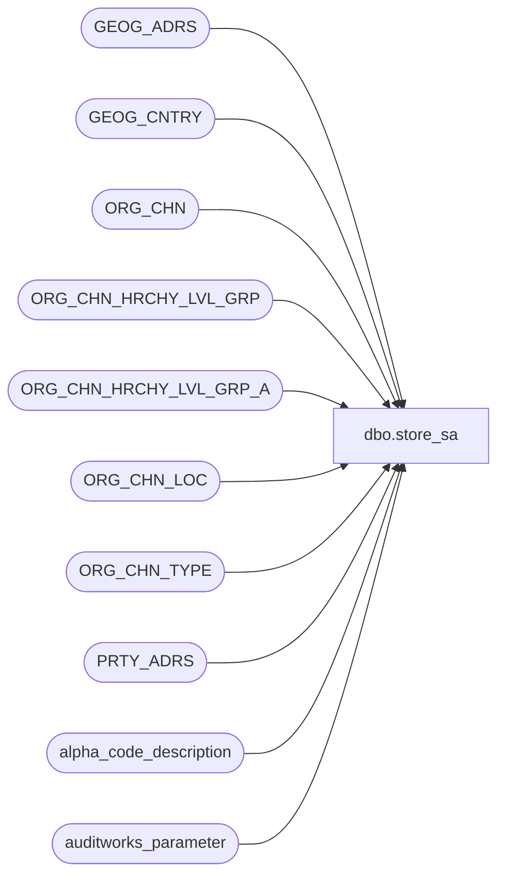

# dbo.store_sa

**Database:** auditworks  
**Server:** bedrockdb01  

## Architecture Diagram



## Table Dependencies

| Referenced Table |
|---|
| GEOG_ADRS |
| GEOG_CNTRY |
| ORG_CHN |
| ORG_CHN_HRCHY_LVL_GRP |
| ORG_CHN_HRCHY_LVL_GRP_A |
| ORG_CHN_LOC |
| ORG_CHN_TYPE |
| PRTY_ADRS |
| alpha_code_description |
| auditworks_parameter |

## View Code

```sql
CREATE VIEW dbo.store_sa  AS
 SELECT 
	store_no = OC.ORG_CHN_NUM, 
	store_name = OC.ORG_CHN_NAME, 
	store_short_name = OC.ORG_CHN_SHRT_NAME,  
	store_status_code = 
      MAX(CASE WHEN OC.CLS_DATE IS NOT NULL 
	         THEN acd.clsdcode
	         ELSE CASE WHEN OC.ORG_CHN_TYPE_CODE = 'WH' 
	                   THEN acd.whcode 
	                   ELSE CASE WHEN OC.COMP_DATE IS NULL
	                             THEN acd.newcode
	                             ELSE acd.compcode
	                        END
	              END
            END), 
	store_manager = convert(varchar, NULL),
	selling_space = SUM(OCL.AREA_SIZE), 
	open_period = NULL,
	comp_period = NULL,
	closed_date = OC.CLS_DATE, 
	selling_nonselling_flag = CASE WHEN OCT.SYS_CODE = 'STR' THEN 1 ELSE 0 END,
 	division_code = MAX(convert(smallint, div.HRCHY_LVL_GRP_CODE)),
	region_code = MAX(reg.HRCHY_LVL_GRP_CODE),
	district_code = MAX(dst.HRCHY_LVL_GRP_CODE),
 	phone_no = NULL,
	time_stamp = NULL,
	location_id = OC.EXTRNL_RFRNC_NUM,
	comp_date = OC.COMP_DATE, 
	open_date = OC.OPEN_DATE, 
	settlement_billing_name = OC.STLMNT_BLNG_NAME, 
	country_code = ISNULL(GC.CNTRY_CODE_ISO2, GC.CNTRY_CODE_ISO3),
	city = GA.CITY, 
	state_code = GA.TRTRY_CODE, 
	zip_code = GA.POST_CODE,
      open_to_receive_date = OC.OPEN_TO_RCV_DATE, 
	GA.CNTRY_CODE_ISO3
  FROM ORG_CHN OC
       LEFT OUTER JOIN 
        (SELECT MAX(CASE WHEN cd.system_code = 'W' THEN cd.code ELSE '' END) whcode, 
                MAX(CASE WHEN cd.system_code = 'C' THEN cd.code ELSE '' END) compcode, 
	        MAX(CASE WHEN cd.system_code = 'S' THEN cd.code ELSE '' END) clsdcode, 
	        MAX(CASE WHEN cd.system_code = 'N' THEN cd.code ELSE '' END) newcode 
           FROM alpha_code_description cd
          WHERE cd.code_type = 1
            AND cd.code_status = 'U') acd
          ON 1=1
       INNER JOIN PRTY_ADRS PA
          ON OC.PRTY_ID = PA.PRTY_ID
         AND OC.DFLT_ADRS_SEQ = PA.PRTY_ADRS_SEQ
         AND PA.EFCTV_STRT_DATE < GETDATE()
         AND (PA.EFCTV_END_DATE >= GETDATE() OR PA.EFCTV_END_DATE IS NULL)
       INNER JOIN GEOG_ADRS GA
          ON PA.ADRS_ID = GA.ADRS_ID
       INNER JOIN ORG_CHN_LOC OCL
	    ON OC.ORG_CHN_NUM = OCL.ORG_CHN_NUM
       INNER JOIN ORG_CHN_TYPE OCT
          ON OC.ORG_CHN_TYPE_CODE = OCT.ORG_CHN_TYPE_CODE
       INNER JOIN GEOG_CNTRY GC
          ON GA.CNTRY_CODE_ISO3 = GC.CNTRY_CODE_ISO3
       LEFT OUTER JOIN auditworks_parameter divp
         ON divp.par_name = 'division_HRCHY_LVL_ID'
        AND divp.par_bin_value IS NOT NULL
       LEFT OUTER JOIN ORG_CHN_HRCHY_LVL_GRP_A divx
         ON divx.HRCHY_LVL_ID = divp.par_bin_value
        AND divx.ORG_CHN_NUM = OC.ORG_CHN_NUM 
	 LEFT OUTER JOIN ORG_CHN_HRCHY_LVL_GRP div
         ON divx.HRCHY_LVL_GRP_ID = div.HRCHY_LVL_GRP_ID
        AND IsNumeric(div.HRCHY_LVL_GRP_CODE) = 1
       LEFT OUTER JOIN auditworks_parameter regp
         ON regp.par_name = 'region_HRCHY_LVL_ID'
        AND regp.par_bin_value IS NOT NULL
       LEFT OUTER JOIN ORG_CHN_HRCHY_LVL_GRP_A regx
         ON regx.HRCHY_LVL_ID = regp.par_bin_value
        AND regx.ORG_CHN_NUM = OC.ORG_CHN_NUM 
	 LEFT OUTER JOIN ORG_CHN_HRCHY_LVL_GRP reg
         ON regx.HRCHY_LVL_GRP_ID = reg.HRCHY_LVL_GRP_ID
       LEFT OUTER JOIN auditworks_parameter dstp
         ON dstp.par_name = 'district_HRCHY_LVL_ID'
        AND dstp.par_bin_value IS NOT NULL
       LEFT OUTER JOIN ORG_CHN_HRCHY_LVL_GRP_A dstx
         ON dstx.HRCHY_LVL_ID = dstp.par_bin_value
        AND dstx.ORG_CHN_NUM = OC.ORG_CHN_NUM 
	 LEFT OUTER JOIN ORG_CHN_HRCHY_LVL_GRP dst
         ON dstx.HRCHY_LVL_GRP_ID = dst.HRCHY_LVL_GRP_ID
GROUP BY OC.ORG_CHN_NUM,OC.ORG_CHN_NAME,OC.ORG_CHN_SHRT_NAME, OC.CLS_DATE,OCT.SYS_CODE,OC.EXTRNL_RFRNC_NUM,OC.COMP_DATE,
OC.OPEN_DATE,OC.STLMNT_BLNG_NAME,ISNULL(GC.CNTRY_CODE_ISO2, GC.CNTRY_CODE_ISO3),GA.CITY, GA.TRTRY_CODE,GA.POST_CODE,OC.OPEN_TO_RCV_DATE,GA.CNTRY_CODE_ISO3
```

