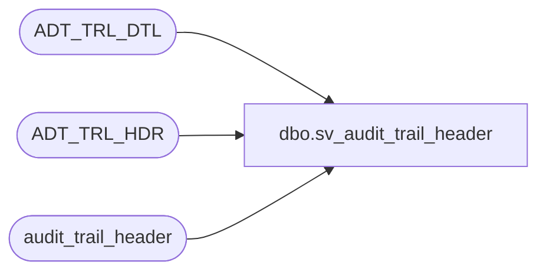

# dbo.sv_audit_trail_header

**Database:** auditworks  
**Server:** bedrockdb01  

## Architecture Diagram



## Table Dependencies

| Referenced Table |
|---|
| ADT_TRL_DTL |
| ADT_TRL_HDR |
| audit_trail_header |

## View Code

```sql
create view dbo.sv_audit_trail_header as
select convert(binary(16), entry_id) entry_id,
       table_name,
       table_key,
       table_key_descr,
       user_name,
       entry_date,
       action,
       function_no
from audit_trail_header
UNION       
select entry_id = ATH.ENTRY_ID,
       table_name =TBL_NAME,
       table_key =TBL_KEY,
       table_key_descr = TBL_KEY,
       user_name =USER_NAME,
       entry_date =ENTRY_DATE_TIME,
       action = CASE WHEN ACTN_CODE = 'A'
                THEN 1
                WHEN ACTN_CODE = 'D'
                THEN 3
                ELSE 2
                END,   --- A,D,M
       function_no =  FNCTN_NUM   
FROM ADT_TRL_HDR ATH
JOIN ADT_TRL_DTL ATD
   ON ATH.ENTRY_ID = ATD.ENTRY_ID
```

