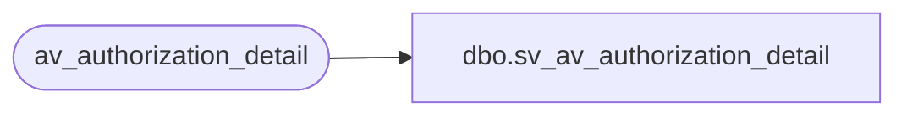

# dbo.sv_av_authorization_detail

**Database:** auditworks  
**Server:** bedrockdb01  

## Architecture Diagram



## Table Dependencies

| Referenced Table |
|---|
| av_authorization_detail |

## View Code

```sql
create view dbo.sv_av_authorization_detail
as

/* SmartView: rename the av_transaction_id field */

SELECT  transaction_id = av_transaction_id ,line_id, card_type, 
	authorization_no, expiry_date, swipe_indicator, approval_message,
	license_no, pos_state_code, other_id_type, other_id, 
	deferred_billing_date, deferred_billing_plan, signature,
	customer_signature_obtained, offline_flag
	FROM av_authorization_detail
```

