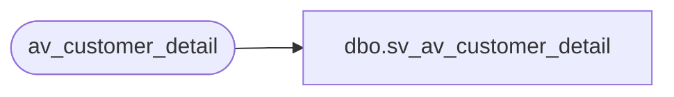

# dbo.sv_av_customer_detail

**Database:** auditworks  
**Server:** bedrockdb01  

## Architecture Diagram



## Table Dependencies

| Referenced Table |
|---|
| av_customer_detail |

## View Code

```sql
create view dbo.sv_av_customer_detail 
AS

/* SmartView: Rename the av_transaction_id field */

SELECT transaction_id = av_transaction_id, line_id, customer_role,
  customer_info_type, customer_info
	FROM av_customer_detail
```

