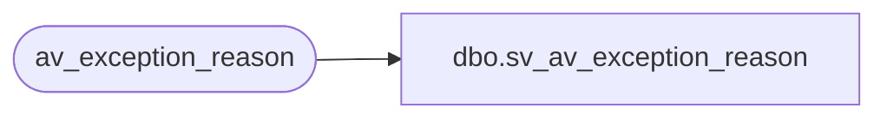

# dbo.sv_av_exception_reason

**Database:** auditworks  
**Server:** bedrockdb01  

## Architecture Diagram



## Table Dependencies

| Referenced Table |
|---|
| av_exception_reason |

## View Code

```sql
create view dbo.sv_av_exception_reason
as

/* SmartView: Rename the av_transaction_id field */

SELECT transaction_id = av_transaction_id, line_id, 
	violated_exception_rule, verified, exception_type
	FROM av_exception_reason
```

