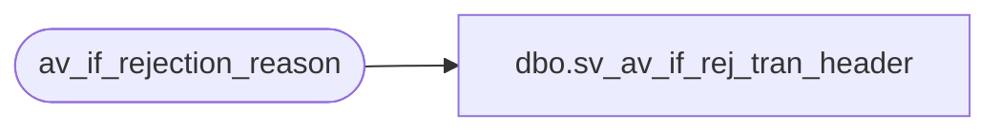

# dbo.sv_av_if_rej_tran_header

**Database:** auditworks  
**Server:** bedrockdb01  

## Architecture Diagram



## Table Dependencies

| Referenced Table |
|---|
| av_if_rejection_reason |

## View Code

```sql
create view dbo.sv_av_if_rej_tran_header 
as

/* SmartView: Rename the av_transaction_id field */

SELECT av_transaction_id as transaction_id
FROM  av_if_rejection_reason i
```

