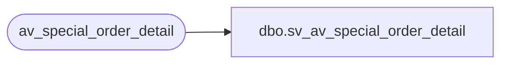

# dbo.sv_av_special_order_detail

**Database:** auditworks  
**Server:** bedrockdb01  

## Architecture Diagram



## Table Dependencies

| Referenced Table |
|---|
| av_special_order_detail |

## View Code

```sql
create view dbo.sv_av_special_order_detail
as

/* SmartView: Rename the av_transaction_id field */

SELECT transaction_id = av_transaction_id, line_id, units, salesperson,
	merchandise_description, expecting_delivery_on, color_description,
	size_description, width_description, vendor_name, 
	vendor_style_description, spo_class_description, vendor_no
	FROM av_special_order_detail
```

