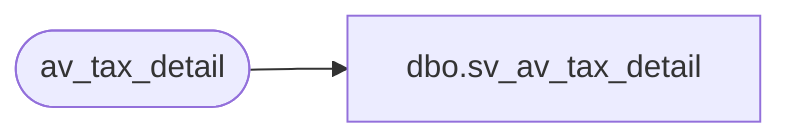

# dbo.sv_av_tax_detail

**Database:** auditworks  
**Server:** bedrockdb01  

## Architecture Diagram



## Table Dependencies

| Referenced Table |
|---|
| av_tax_detail |

## View Code

```sql
create view dbo.sv_av_tax_detail   
AS

SELECT transaction_id = av_transaction_id,
line_id,
tax_level,
tax_jurisdiction,
tax_category,
tax_rate_code,
taxable_amount,
tax_amount,
combined_rate,
nontaxable_amount,
tax_amount_expected,
tax_on_tax_level,
tax_on_combined_rate,
line_object_type,
tax_strip_flag,
gl_effect 
FROM av_tax_detail
```

