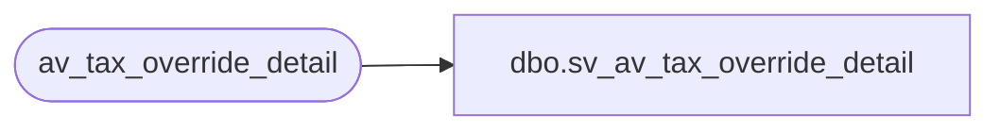

# dbo.sv_av_tax_override_detail

**Database:** auditworks  
**Server:** bedrockdb01  

## Architecture Diagram



## Table Dependencies

| Referenced Table |
|---|
| av_tax_override_detail |

## View Code

```sql
create view dbo.sv_av_tax_override_detail
as
/* SmartView: Rename the av_transaction_id field */

SELECT transaction_id = av_transaction_id, line_id, tax_level,
	tax_category, taxable, exception_tax_jurisdiction, 
	tax_exempt_no
	FROM av_tax_override_detail
```

