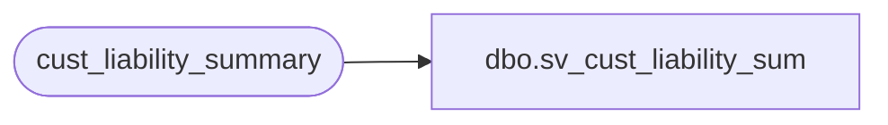

# dbo.sv_cust_liability_sum

**Database:** auditworks  
**Server:** bedrockdb01  

## Architecture Diagram



## Table Dependencies

| Referenced Table |
|---|
| cust_liability_summary |

## View Code

```sql
create view dbo.sv_cust_liability_sum       
      (transaction_date,
       glc_type, 
       tracking_id, 
       liability_incurred_date, 
       change_in_liability_balance)
as
select transaction_date,
       reference_type, 
       tracking_id, 
       liability_incurred_date, 
       change_in_liability_balance
  from cust_liability_summary
```

