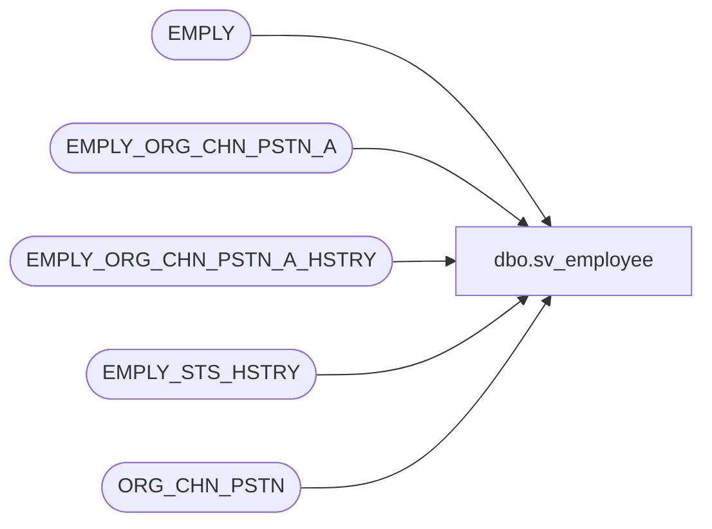

# dbo.sv_employee

**Database:** auditworks  
**Server:** bedrockdb01  

## Architecture Diagram



## Table Dependencies

| Referenced Table |
|---|
| EMPLY |
| EMPLY_ORG_CHN_PSTN_A |
| EMPLY_ORG_CHN_PSTN_A_HSTRY |
| EMPLY_STS_HSTRY |
| ORG_CHN_PSTN |

## View Code

```sql
create view dbo.sv_employee as
SELECT employee_no = E.EMPLY_NUM,
    employee_first_name = E.FRST_NAME,
    employee_last_name = E.LAST_NAME,
    home_store_no = E.PRMY_ORG_CHN_NUM,
    employee_type = ISNULL(EOCPA.PSTN_CODE,EOCPAH.PSTN_CODE),--- WILL RETURN ALL POSSIBLE JOB ASSIGNMENTS, NO PRIMARY ONE
    verified = 0,
    house_account_no = E.HS_ACNT_NUM,
    date_of_hire =  convert(varchar(10),MIN(ESH.EFCTV_DATE),101)  + ' ' + convert(varchar(8),MIN(ESH.EFCTV_DATE),114),--MIN(ESH.EFCTV_DATE),
    date_of_termination = null, --convert(varchar(10),ESH1.EFCTV_DATE,101)  + ' ' + convert(varchar(8),ESH1.EFCTV_DATE,114),--ESH1.EFCTV_DATE,
    employee_department = EOCPA.PRMRY_LOC_ID, -- no primary loc id in history table
    employee_type_descr = ISNULL(OCP.PSTN_DESC,OCP1.PSTN_DESC),
    timestamp = NULL
FROM EMPLY E
JOIN EMPLY_STS_HSTRY ESH 
    ON E.EMPLY_NUM = ESH.EMPLY_NUM
    AND ESH.EMPLY_STS_CODE = 'HIRE'
    AND  E.EMPLY_STS_CODE NOT IN ('TERM','SUSP','RESN','RETD')
LEFT OUTER JOIN EMPLY_ORG_CHN_PSTN_A EOCPA INNER JOIN ORG_CHN_PSTN OCP
    ON (EOCPA.PSTN_CODE = OCP.PSTN_CODE)
    ON (E.EMPLY_NUM = EOCPA.EMPLY_NUM
    AND E.PRMY_ORG_CHN_NUM = EOCPA.ORG_CHN_NUM
        ---  AND PRIMARY FLAG = TRUE
    AND EOCPA.EFCTV_DATE <= getdate() 
    AND EOCPA.EXPRTN_DATE IS NULL)
LEFT OUTER JOIN  EMPLY_ORG_CHN_PSTN_A_HSTRY EOCPAH INNER JOIN ORG_CHN_PSTN OCP1
    ON (EOCPAH.PSTN_CODE = OCP1.PSTN_CODE) 
    ON (E.EMPLY_NUM = EOCPAH.EMPLY_NUM
    AND E.PRMY_ORG_CHN_NUM = EOCPAH.ORG_CHN_NUM
    ---  AND PRIMARY FLAG = TRUE
    AND EOCPAH.EFCTV_DATE <= getdate() 
    AND EOCPAH.EXPRTN_DATE > getdate()) 
GROUP BY E.EMPLY_NUM,E.FRST_NAME,E.LAST_NAME,E.PRMY_ORG_CHN_NUM, 
        ISNULL(EOCPA.PSTN_CODE,EOCPAH.PSTN_CODE),E.HS_ACNT_NUM, --	ESH1.EFCTV_DATE --,	
        EOCPA.PRMRY_LOC_ID ,ISNULL(OCP.PSTN_DESC,OCP1.PSTN_DESC)
--- HOW DO WE GET THE LAST PRIMARY ASSIGNMENT OF AN EX-EMPLOYEE
-- DOES THE OACPA TABLE.EXPRNT DATE STAY NULL OR IS IT SET TO EFCTV DATE OF NEW STATUS   --- doesnt
UNION 
SELECT employee_no = E.EMPLY_NUM,
    employee_first_name = E.FRST_NAME,
    employee_last_name = E.LAST_NAME,
    home_store_no = E.PRMY_ORG_CHN_NUM,
    employee_type = ISNULL(EOCPA.PSTN_CODE,EOCPAH.PSTN_CODE ), --- WILL RETURN ALL POSSIBLE JOB ASSIGNMENTS, NO PRIMARY ONE
    verified = 0,
    house_account_no = E.HS_ACNT_NUM,
    date_of_hire =  convert(varchar(10),MIN(ESH.EFCTV_DATE),101)  + ' ' + convert(varchar(8),MIN(ESH.EFCTV_DATE),114),--MIN(ESH.EFCTV_DATE),
    date_of_termination = convert(varchar(10),ESH1.EFCTV_DATE,101)  + ' ' + convert(varchar(8),ESH1.EFCTV_DATE,114),--ESH1.EFCTV_DATE,
    employee_department = EOCPA.PRMRY_LOC_ID,  -- no primary loc id in history table
    employee_type_descr = ISNULL(OCP.PSTN_DESC,OCP1.PSTN_DESC),
    timestamp = NULL
FROM EMPLY E
JOIN EMPLY_STS_HSTRY ESH 
    ON E.EMPLY_NUM = ESH.EMPLY_NUM
    AND ESH.EMPLY_STS_CODE = 'HIRE'
    AND  E.EMPLY_STS_CODE IN ('TERM','SUSP','RESN','RETD')
JOIN  EMPLY_STS_HSTRY ESH1       
    ON E.EMPLY_NUM = ESH1.EMPLY_NUM
    AND ESH1.EMPLY_STS_CODE = E.EMPLY_STS_CODE
LEFT OUTER JOIN EMPLY_ORG_CHN_PSTN_A EOCPA INNER JOIN ORG_CHN_PSTN OCP
    ON (EOCPA.PSTN_CODE = OCP.PSTN_CODE)
    ON (E.EMPLY_NUM = EOCPA.EMPLY_NUM
    AND E.PRMY_ORG_CHN_NUM = EOCPA.ORG_CHN_NUM
    AND EOCPA.EFCTV_DATE <= getdate() 
        ---  AND PRIMARY FLAG = TRUE
    AND EOCPA.EXPRTN_DATE IS NULL)
LEFT OUTER JOIN  EMPLY_ORG_CHN_PSTN_A_HSTRY EOCPAH INNER JOIN ORG_CHN_PSTN OCP1
    ON (EOCPAH.PSTN_CODE = OCP1.PSTN_CODE) 
    ON (E.EMPLY_NUM = EOCPAH.EMPLY_NUM
    AND E.PRMY_ORG_CHN_NUM = EOCPAH.ORG_CHN_NUM
        ---  AND PRIMARY FLAG = TRUE
    AND EOCPAH.EFCTV_DATE <= getdate() 
    AND EOCPAH.EXPRTN_DATE > getdate())      
GROUP BY E.EMPLY_NUM,E.FRST_NAME,E.LAST_NAME,E.PRMY_ORG_CHN_NUM, 
        ISNULL(EOCPA.PSTN_CODE,EOCPAH.PSTN_CODE),E.HS_ACNT_NUM, ESH1.EFCTV_DATE,
        EOCPA.PRMRY_LOC_ID ,ISNULL(OCP.PSTN_DESC,OCP1.PSTN_DESC)
```

