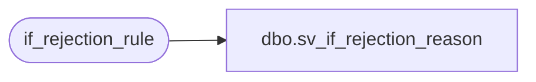

# dbo.sv_if_rejection_reason

**Database:** auditworks  
**Server:** bedrockdb01  

## Architecture Diagram



## Table Dependencies

| Referenced Table |
|---|
| if_rejection_rule |

## View Code

```sql
create view dbo.sv_if_rejection_reason   as
SELECT if_rejection_reason, if_rejection_description FROM if_rejection_rule
```

