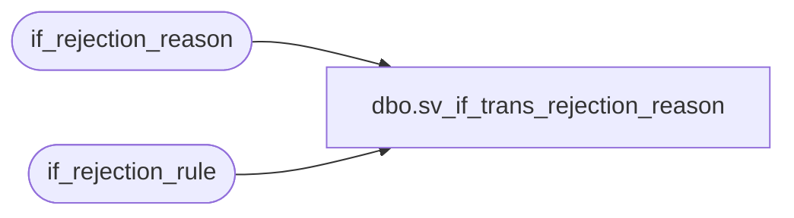

# dbo.sv_if_trans_rejection_reason

**Database:** auditworks  
**Server:** bedrockdb01  

## Architecture Diagram



## Table Dependencies

| Referenced Table |
|---|
| if_rejection_reason |
| if_rejection_rule |

## View Code

```sql
create view dbo.sv_if_trans_rejection_reason   as

SELECT a.transaction_id, a.line_id, a.if_reject_reason,
a.deferred ,a.memo1, a.memo2 , a.memo3 , a.replace_upc_no,
a.replace_line_object, a.replace_line_action, a.process_id,
b.if_rejection_description 
FROM if_rejection_reason a, if_rejection_rule b
WHERE a.if_reject_reason = b.if_rejection_reason
```

