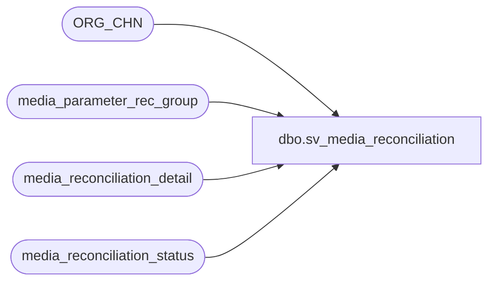

# dbo.sv_media_reconciliation

**Database:** auditworks  
**Server:** bedrockdb01  

## Architecture Diagram



## Table Dependencies

| Referenced Table |
|---|
| ORG_CHN |
| media_parameter_rec_group |
| media_reconciliation_detail |
| media_reconciliation_status |

## View Code

```sql
create view dbo.sv_media_reconciliation AS
SELECT
	mrd.store_no,
	mrs.register_no,
	mrs.cashier_no,
	mrd.transaction_date,
	mrd.line_object,
	max(mprg.short_tolerance_amount) as acceptable_short_limit,
	max(1 - sign(mprg.rec_option + 1)) as media_not_counted,
	max(abs(abs(mprg.rec_option) - 1)) as variance_is_short,
	max(1 - sign(abs(mprg.rec_option - 1))) as variance_is_lost_doc,
	max(sign(1 + sign(mrd.audit_activity_flag - 20))) as media_rec_verified,
	max(1 - sign(10 - mrs.rec_type)) as deposit_category,
	max(s.PRMRY_BANK_ACNT_ID) as deposit_destination,
	max(1 - sign(10 - mrs.rec_type)) as deposit_source,
	sum(mrd.rec_amount * abs(sign(mrd.rec_side - 1)) * sign(abs(mrd.rec_amount_subtype - 3))
	    * (1 - sign(mrd.rec_amount_type - 1)) * (1 - sign(mrs.rec_type - 4))) as expected_media_amount,
	sum(mrd.rec_amount * abs(sign(mrd.rec_side - 1)) 
	    * sign(mrd.rec_amount_type - 1) * (1 - sign(mrs.rec_type - 4))) as expected_exchange_amount,
	sum(mrd.rec_amount * (1 - abs(sign(mrd.rec_side - 1))) 
	    * (1 - sign(mrs.rec_type - 4))
	    * (1 - (  abs(sign(mrd.rec_amount_subtype - 4)) 
	    	    * abs(sign(mrd.rec_amount_subtype - 14)) 
	    	    * abs(sign(mrd.rec_amount_subtype - 24))
	    	   )
	      )
	   ) as counted_media_amount,
	sum(mrd.rec_amount * abs(sign(mrd.rec_side - 1)) * (1-sign(abs(mrd.rec_amount_subtype - 3)))
	    * (1 - sign(mrd.rec_amount_type - 1)) * (1 - sign(mrs.rec_type - 4))) as pickup_loan_amount,
	sum(mrd.rec_amount * (1 - abs(sign(mrd.rec_side - 1))) 
	    * (1 - sign(10 - mrs.rec_type))
	    * (1 - (  abs(sign(mrd.rec_amount_subtype - 4)) 
	    	    * abs(sign(mrd.rec_amount_subtype - 14)) 
	    	    * abs(sign(mrd.rec_amount_subtype - 24))
	    	   )
	      )
	    ) as declared_deposit_amount,
	sum(mrd.rec_amount * (1 - abs(sign(mrd.rec_side - 1))) 
	    * (1 - (  abs(sign(mrd.rec_amount_subtype - 5)) 
	    	    * abs(sign(mrd.rec_amount_subtype - 15)) 
	    	    * abs(sign(mrd.rec_amount_subtype - 25))
	    	   )
	      )
	    ) as tender_short,
	NULL as remark
 FROM media_reconciliation_detail mrd, 
      media_reconciliation_status mrs, 
      media_parameter_rec_group mprg, 
      ORG_CHN s
WHERE mrs.rec_type in (4, 10)
  AND mrd.rec_amount_type in (1, 3, 5)
  AND mrd.balancing_entity_id = mrs.balancing_entity_id
  AND mrs.media_parameter_set_no = mprg.media_parameter_set_no 
  AND mrs.rec_type = mprg.rec_type
  AND mrs.rec_group_line_object = mprg.rec_group_line_object
  AND mrd.store_no = s.ORG_CHN_NUM
GROUP BY mrd.store_no,
	mrs.register_no,
	mrs.cashier_no,
	mrd.transaction_date,
	mrd.line_object
```

