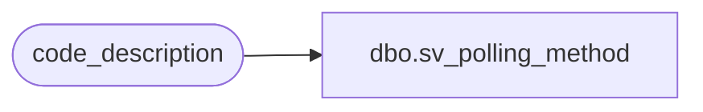

# dbo.sv_polling_method

**Database:** auditworks  
**Server:** bedrockdb01  

## Architecture Diagram



## Table Dependencies

| Referenced Table |
|---|
| code_description |

## View Code

```sql
create view dbo.sv_polling_method

AS

select code, code_display_descr
from code_description
where code_type = 14
```

