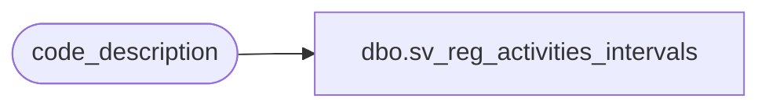

# dbo.sv_reg_activities_intervals

**Database:** auditworks  
**Server:** bedrockdb01  

## Architecture Diagram



## Table Dependencies

| Referenced Table |
|---|
| code_description |

## View Code

```sql
create view dbo.sv_reg_activities_intervals
AS
SELECT code, code_display_descr FROM code_description
WHERE code_type = 49
```

